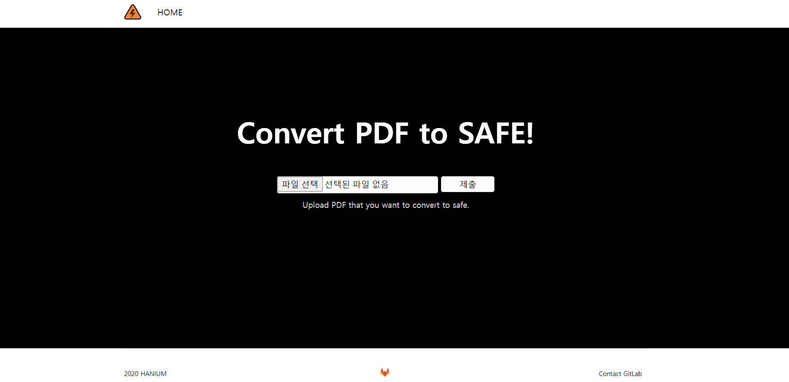

### Dangerzone project developed by flask (Updated 20.07.21)

### 프론트엔드 부분 추가
* header by 고희수, section by 서민정, footer by 양현지  

프론트엔드 부분 추가 후 메인 화면 접속 시 나타나는 화면 예시입니다.  

 

### 실행방법
- Windows
git clone 또는 zip으로 다운받은 뒤,  flask run 또는 python app.py를 통해 실행 가능합니다.
접속 확인은 [localhost:5000/upload](localhost:5000/upload) 에서 가능합니다.

- Ubuntu
```
cd flask
source venv/bin/activate
python app.py
```
실행 이후, aws ubuntu ec2의 IPv4 퍼블릭 주소인 http://54.180.109.243:5000/upload 로 접속하면 가능합니다. 


### 설치
- Windows

`pip install flask`
`pip install werkzeug`
- Ubuntu

`pip install Flask`


### 부족한 점
해당 프로젝트는 이후 파일을 dangerzone으로 넘겨주어야하므로 dangerzone이 설치 가능한 ubuntu 18.04LTS에서 개발되어야합니다. AWS Ubuntu (key pair name = "smj_key") EC2를 활용하여 접속 후 개발이 진행되어야합니다.


### TODO
- file upload 후 localhost가 아닌 '지정 url'로 실행되도록
- 받은 file을 dangerzone 프로세스로 넘겨주기
- frontend 부분 볼만하게 수정하기
